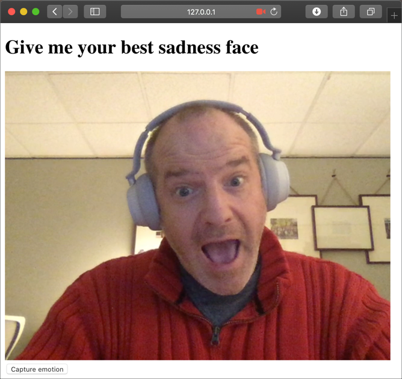

# Build out the game to capture from the camera and check for emotion

In the [previous step](./CreateAFaceResource.md) you created a Face API resource that can be used to analyse the camera images. In this step you will build out the game to capture frames from the camera and look for emotions.

## Install the Face Api package

The Face Api is available as a Python package.

* Open the `requirements.txt` file in Visual Studio Code.

* Add the following to the bottom of the file:

  ```python
  azure-cognitiveservices-vision-face
  ```

* Save the file

* Install the new package from the terminal using the following command:
  
  ```sh
  pip3 install -r requirements.txt
  ```

## Write the code

* Open the `app.py` file in Visual Studio Code.

* Add imports for the Face Api package and an authentication package, as well as some system libraries and additional imports from the Flask module to the top of the file.
  
  ```python
  import random, os, io, base64
  from flask import Flask, render_template, request, jsonify
  from azure.cognitiveservices.vision.face import FaceClient
  from msrest.authentication import CognitiveServicesCredentials
  ```

* Add the following code below the imports:

  ```python
  credentials = CognitiveServicesCredentials(face_api_key)
  face_client = FaceClient(face_api_endpoint, credentials=credentials)

  def best_emotion(emotion):
    emotions = {}
    emotions['anger'] = emotion.anger
    emotions['contempt'] = emotion.contempt
    emotions['disgust'] = emotion.disgust
    emotions['fear'] = emotion.fear
    emotions['happiness'] = emotion.happiness
    emotions['neutral'] = emotion.neutral
    emotions['sadness'] = emotion.sadness
    emotions['surprise'] = emotion.surprise
    return max(zip(emotions.values(), emotions.keys()))[1]
  ```

* Create a new route for `/result` that accepts POST requests to the bottom of the file.

  ```python
  @app.route('/result', methods=['POST'])
  def check_results():
    body = request.get_json()
    desired_emotion = body['emotion']

    base64_image = base64.b64decode(body['image_base64'].split(',')[1])
    image = io.BytesIO(base64_image)

    faces = face_client.face.detect_with_stream(image,
                                                return_face_attributes=['emotion'])

    if len(faces) == 1:
      detected_emotion = best_emotion(faces[0].face_attributes.emotion)

      if detected_emotion == body['emotion']:
        return jsonify({
          'message': '✅ You won! You showed ' + desired_emotion
        })
      else:
        return jsonify({
            'message': '❌ You failed! You needed to show ' + desired_emotion + ' but you showed ' + detected_emotion
        })
    else:
      return jsonify({
        'message': '☠️ ERROR: No faces detected'
      })
  ```

* Open the `home.html` file from the `templates` folder.

* Add the following code inside the event listener in the `<script>` tag. Put it after the other code already in this listener.

  ```js
  var message = document.getElementById('message');

  document.getElementById('snap').addEventListener('click', function() {
    var canvas = document.createElement('canvas');
    canvas.width = 640;
    canvas.height = 480;
    var context = canvas.getContext('2d');
    context.drawImage(video, 0, 0, canvas.width, canvas.height);

    var data = {
      'image_base64': canvas.toDataURL("image/png"),
      'emotion': '{{ page_data.emotion }}'
    }

    const getResult = async () => {
      var result = await fetch('result', {
        method: 'POST',
        body: JSON.stringify(data),
        headers: { 'Content-Type': 'application/json' }
      })

      var jsonResult = await result.json()
      message.textContent = jsonResult.message
    }
    getResult()
  });
  ```

## Run the code

There are two ways to run this code:

* From the Debug pane of the toolbar, select the green *Start Debugging* button.

  If you use this method you will be able to set breakpoints and debug your code.

* From the terminal, run the file as a Flask app using:
  
  ```sh
  flask run
  ```

  If you use this method you will not be able to set breakpoints and debug your code.

The Web App will be run, and can be accessed from your device at [http://127.0.0.1:5000](http://127.0.0.1:5000). You will see this URL in the output window, and you can use **ctrl+click** to go directly to this site.

* Open this URL in a web browser to see the game web page. You may be asked for permission for the page to access the camera. If this happens you many want to always allow this to save being asked every time. One the page you will see a random emotion being asked for, and a live feed from your camera.

  

* Stop the debugger once you have tested this out.

## Play the game

Every time you load the page it will select a different emotion.

* Look at your camera and do your best to show the requested emotion.

* Click the **Capture emotion** button. An image will be captured and checked for your emotion.

* You will either see a green check showing you successfully showed the given emotion, or a red cross if you didn't, along with the emotion the Face API thought you showed. If no faces are in the image you will see an error.

  

## Deploy the code

Once the code is working locally, it can be deployed to Azure so others can play the game.

* Open the command palette:
  * On Windows, press Ctrl+Shift+P
  * On MacOS, press Cmd+Shift+P

* Select *Azure App Service: Deploy to Web App...*
  
  

* A dialog will pop up asking if you want to overwrite the existing deployment. Select the **Deploy** button.
  
  

* A popup will appear showing the deployment progress. You can monitor the progress from the *Output* window by selecting *View -> Output* and selecting *Azure App Service* from the window selector.
  
  

* Open the web site in your browser and play the game.

## Next step

In this step you built out the game to capture frames from the camera and look for emotions. In the [next step](./CleanUp.md) you will clean up your Azure resources.
